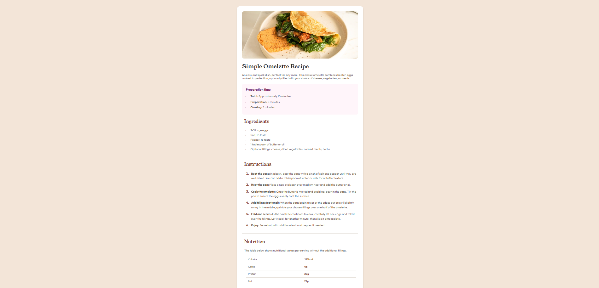

# Frontend Mentor - Recipe page solution

This is a solution to the [Recipe page challenge on Frontend Mentor](https://www.frontendmentor.io/challenges/recipe-page-KiTsR8QQKm). Frontend Mentor challenges help you improve your coding skills by building realistic projects.

## Table of contents

- [Overview](#overview)
  - [Screenshot](#screenshot)
  - [Links](#links)
- [My process](#my-process)
  - [Built with](#built-with)
  - [What I learned](#what-i-learned)
  - [Continued development](#continued-development)
  - [Useful resources](#useful-resources)
- [Author](#author)
- [Acknowledgments](#acknowledgments)

## Overview

### Screenshot



### Links

- Live Site URL: https://mater9.github.io/recipe-page/

## My process

### Built with

- Semantic HTML5 markup
- CSS custom properties
- Flexbox
- Mobile-first workflow
- Google Fonts (Young Serif, Outfit)
- Responsive design
- HSL color variables
- HTML tables
- Media queries for different screen sizes

### What I learned

In this project, I focused on creating a responsive recipe page that looks good on both mobile and desktop devices. Here are some key things I learned:

- Using semantic HTML to structure recipe content
- Implementing responsive design with media queries:

```css
@media (max-width: 768px) {
  body {
    padding: 0;
    margin: 0;
    background-color: hsl(0, 0%, 100%);
  }
}
```

- Styling lists and markers:

```css
.ingredients-list li::marker {
  color: hsl(14, 45%, 36%);
  font-size: 13px;
}
```

- Creating responsive nutrition tables:

```css
.nutrition-table {
  width: 95%;
  border-collapse: collapse;
  margin: 24px 24px 24px 24px;
}
```

- Working with different Google Fonts and their proper implementation

### Continued development

In future projects, I plan to focus on:

- Enhancing accessibility features
- Exploring CSS Grid for more complex layouts
- Improving performance with optimized images and lazy loading techniques

### Useful resources

- [MDN Web Docs](https://developer.mozilla.org/) - A great resource for understanding HTML, CSS, and JavaScript.
- [CSS Tricks](https://css-tricks.com/) - Helpful for learning about Flexbox and responsive design techniques.

## Author

- Frontend Mentor - [@Mater9](https://www.frontendmentor.io/profile/Mater9)
- Twitter

## Acknowledgments

Thanks to the Frontend Mentor community for their support and feedback throughout this project.
